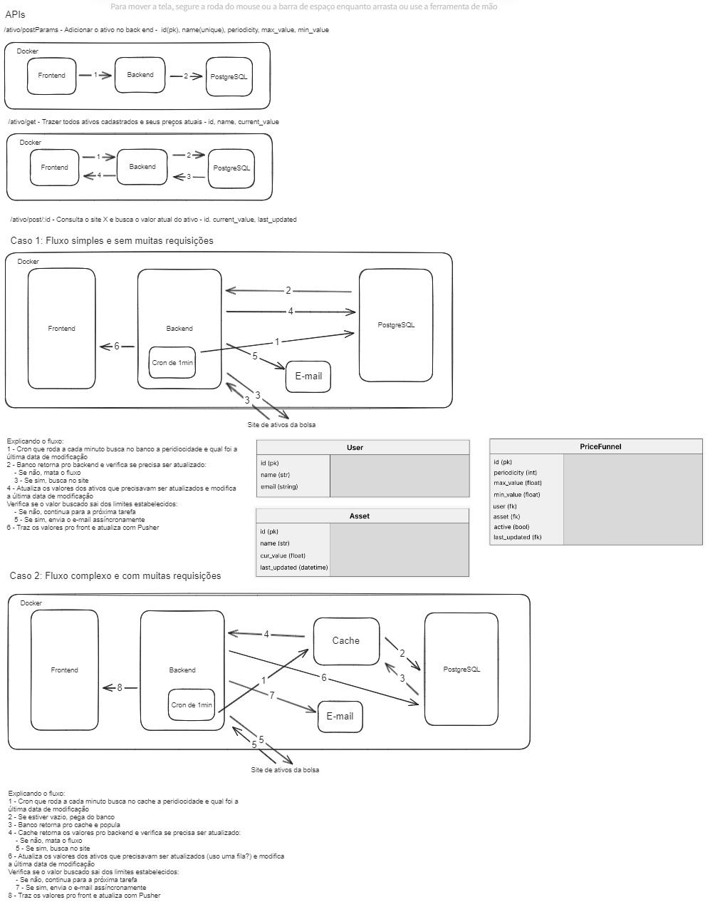

# Inoa

## Visão geral do projeto

Este é um projeto que usa React, Typescript, Vite, Tailwind CSS, Django, Python, PostgreSQL.
É uma stack de desenvolvimento web moderna que é rápida e eficiente para construir aplicativos web escaláveis.

## Preview

O objetivo é permitir que o usuário consiga ter maior controle dos seus ativos financeiros através de um interface web ágil e que consiga automatizar em parte o seu processo de compra e venda de ativos através de avisos ao e-mail.

## Pré-requisitos

- Docker
- Docker compose

## Começando

Para iniciar o projeto, siga os passos abaixo:

- Clone o repositório em sua máquina local.
- Rode o comando `npm run build` dentro da pasta `/front` sempre que houver uma mudança para ser refletida no servidor.
- Rode o comando `docker compose up --build` na pasta raiz.

### E-mail

Caso deseje enviar/receber os e-mails de acordo com os ativos cadastrados, configure seu e-mail Google seguindo este [tutorial](https://knowledge.workspace.google.com/kb/how-to-generate-an-app-passwords-000009237?hl=pt-br) e preencha as variáveis `EMAIL_HOST_USER` e `EMAIL_HOST_PASSWORD` no seu arquivo `.env`

## Estrutura de pasta

```
├── front                         # Pasta com informações do front-end
└── back                          # Pasta com informações do back-end
```

## Tecnologias e funcionalidades

### Tecnologias

O projeto inclui as seguintes tecnologias:

- React:
- Typescript:
- Tailwind CSS:
- Django:
- Python:
- PostgreSQL:
- Docker: Container para a aplicação, para que haja uma padronização do projeto independente da máquina utilizada

### Funcionalidades

O projeto possui as seguintes funcionalidades:

- Salvar ativos que o usuário desejar para sua base
- Atualizar as informações dos ativos na peridiocidade estabelecida pelo usuário
- Consultar os dados atualizados dos ativos salvos
- Enviar ao e-mail do usuário quando os padrões do ativo chegarem ao requisitos pré-estabelecidos
- Salvar as informações em um banco relacional (PostgreSQL)

## Decisões técnicas

- Decidiu-se não utilizar cache e fazer a consulta ao banco diretamento sempre que o Cron rodar, pois o número de requisições a princípio é baixa
- Pelo mesmo motivo, optou-se por não se utilizar filas para gravar informações que retornem do site []() no banco. Em ambos os casos, a estrutura atual permite que caso essa mudança seja necessária, será fácil fazer o acoplamento



## Referências

### API Externa

- [Listagem dos ativos - Brapi](https://brapi.dev/docs)

## Melhorias futuras

- Cadastro de usuários
- Uso de cache e de fila caso a quantidade de requisições cresça
